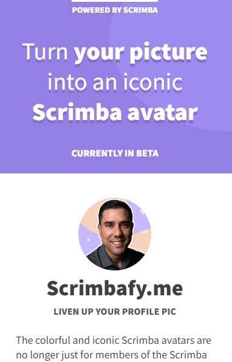

## Table of contents

- [Overview](#overview)

- [Projects](#projects)

  - [1-NFT Site](#nft-site)
  - [2-Product Splash Page](#splash-page)
  - [3-Blog Page](#blog-page)
  - [4-Journal Site](#journal)

  ## Overview

  Completed these projects that are parts of [Scrimba](https://scrimba.com/learn/frontend/)'s Responsive Design Module.  I mastered HTML/CSS and responsive design concepts in these projects.
  You can see the visual representations of the each app below.

  ## Projects

  ### 1-NFT Site App
  
  ### Layout on mobile devices;
  
  
  ### Layout on tablets or wider devices;
  
  
  ### Description

  ### What I Learned?
  

  - Thinking responsively
  - Absolute and relative units
  - Media queries and mobile-first design
  - flex-wrap and gap
  - flex-basis, flex-grow, flex
  - gap property
  - Responsive navbar
  - <meta viewport> tag
  
  
  
  ### 2-Product Splash Page
  
  ### Layout on mobile devices;
  
  
  ### Layout on tablets or wider devices;
  
  
  ### Description

  ### What I Learned?
  
  - Change the case of the text
  - Viewport units(vw,vh)
  - Flexbox orders
  - Box-sizing property
  - Styles form elements, modifiers, pseudo classes like :hover, :focus
  
  
   
  ### 3-Blog Page
  
  ### Layout on mobile devices;
  
  
  ### Layout on tablets or wider devices;
  
  
  ### Description

  ### What I Learned?
  
  - CSS Grids: grid-template-columns
  - grid-gap
  - minmax()
  - fr unit
  - grid areas and media queries
  
  
  
  ### 4-Journal Site
  
  ### Layout on mobile devices;
  

  
  ### Layout on tablets or wider devices;
  
  
